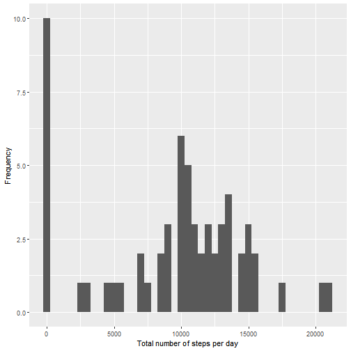
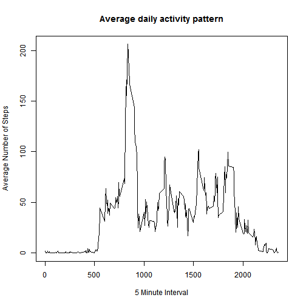
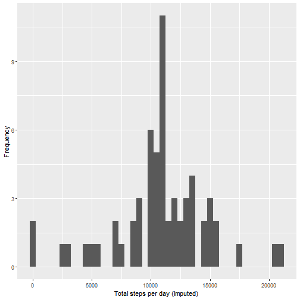
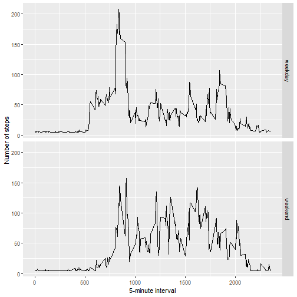

# Reproducible Research: Peer Assessment 1

## Loading and preprocessing the data 

```r
setwd("C:/Users/ycheng10/Documents/")
if(!file.exists('activity.csv')) {
        unzip("repdata_data_activity.zip")
}
Data <- read.csv('activity.csv')
head(Data)
```

```
##   steps       date interval
## 1    NA 2012-10-01        0
## 2    NA 2012-10-01        5
## 3    NA 2012-10-01       10
## 4    NA 2012-10-01       15
## 5    NA 2012-10-01       20
## 6    NA 2012-10-01       25
```

## What is mean total number of steps taken per day?

Sum steps by day, create Histogram, and calculate mean and median.

```r
library(ggplot2)
library(scales)
library(Hmisc)
stepsperDay <- tapply(Data$steps, Data$date, sum, na.rm=TRUE)
qplot(stepsperDay, binwidth=500, xlab='Total number of steps per day', ylab='Frequency')
```



```r
Mean <- mean(stepsperDay)
Median <- median(stepsperDay)
```
The `Mean` is 9354.2295082 and the `Median` is 10395.


## What is the average daily activity pattern?

```r
AvgstepsByInterval <- aggregate(steps ~ interval, Data, mean,na.rm=TRUE)
plot(AvgstepsByInterval$interval,AvgstepsByInterval$steps, type="l", xlab="5 Minute Interval", ylab="Average Number of Steps",main="Average daily activity pattern")
```



```r
maxInterval <- AvgstepsByInterval[which.max(AvgstepsByInterval$steps),1]
```
Interval with Maximum number of step is: 835


## Imputing missing values
#####  Calculate and report the total number of missing values in the dataset 

```r
MissingValues <- length(which(is.na(Data$steps)))
```

Number of missing values: 2304

##### Devise a strategy for filling in all of the missing values in the dataset.
##### Create a new dataset that is equal to the original dataset but with the missing data filled in.

```r
activityDataImputed <- Data
activityDataImputed$steps <- impute(Data$steps, fun=mean)
```


##### Make a histogram of the total number of steps taken each day 

```r
stepsByDayImputed <- tapply(activityDataImputed$steps, activityDataImputed$date, sum)
qplot(stepsByDayImputed, xlab='Total steps per day (Imputed)', ylab='Frequency', binwidth=500)
```



##### ... and Calculate and report the mean and median total number of steps taken per day. 

```r
stepsByDayMeanImputed <- mean(stepsByDayImputed)
stepsByDayMedianImputed <- median(stepsByDayImputed)
```
Mean (Imputed): 1.0766189 &times; 10<sup>4</sup>
Median (Imputed):  1.0766189 &times; 10<sup>4</sup>


## Are there differences in activity patterns between weekdays and weekends?

####  new factor variable in the dataset with two levels - "weekday" and "weekend"


```r
weekday.or.weekend <- function(date) {
    day <- weekdays(date)
    if (day %in% c("Monday", "Tuesday", "Wednesday", "Thursday", "Friday"))
        return("weekday")
    else if (day %in% c("Saturday", "Sunday"))
        return("weekend")
    else
        stop("invalid date")
}
activityDataImputed$date <- as.Date(activityDataImputed$date)
activityDataImputed$day <- sapply(activityDataImputed$date, FUN=weekday.or.weekend)
```

#### anel plot containing a time series plot of interval and the average number of steps averaged across all weekday days, weekend days. 

```r
averages <- aggregate(steps ~ interval + day, data=activityDataImputed, mean)
ggplot(averages, aes(interval, steps)) + geom_line() + facet_grid(day ~ .) +
    xlab("5-minute interval") + ylab("Number of steps")
```


